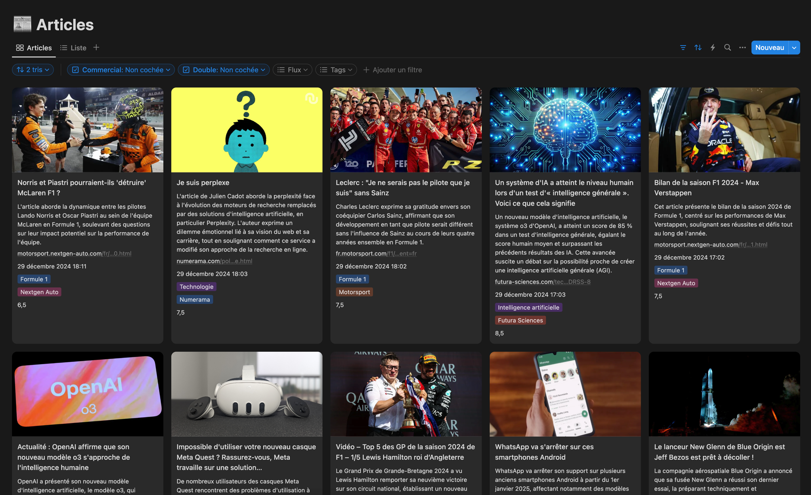

# News Aggregator with AI Analysis 🤖

A Python application that aggregates news from multiple RSS feeds, analyzes them using ChatGPT, and organizes them in Notion.



## 🌟 Features

- 📰 RSS Feed Integration
  - Automatic feed checking at configurable intervals
  - Smart duplicate detection for articles
  - Concurrent feed processing
  - Error handling and retry mechanisms
  - Flexible feed configuration via config.py
  - Feed-specific content extraction rules

- 🤖 AI-Powered Analysis
  - Content analysis using ChatGPT
  - Automatic duplicate detection
  - Commercial content detection
  - Article significance scoring
  - Smart tagging system

- 📊 Notion Integration
  - Automatic page creation
  - Organized database structure
  - Image handling
  - Clean content formatting

- 🛠 Advanced Features
  - Automatic cleaning of old articles
  - Lock system for process management
  - Image optimization
  - Robust error handling

## 🚀 Installation

1. Clone the repository:
```bash
git clone https://github.com/Smax2k/news-py.git
cd news-py
```

2. Create a virtual environment:
```bash
python -m venv venv
source venv/bin/activate  # On Windows: venv\Scripts\activate
```

3. Install dependencies:
```bash
pip install -r requirements.txt
```

4. Configure environment variables:
   - Copy `.env.example` to `.env`
   - Set your API keys:
     - `OPENAI_API_KEY`
     - `NOTION_API_KEY`
     - `NOTION_DATABASE_ID`

## ⚙️ Configuration

Key environment variables:
- `MAX_ARTICLES_PER_FEED`: Maximum articles to process per feed (default: 3)
- `AUTO_CLEAN_THRESHOLD`: Article count threshold for cleaning (default: 400)
- `CLEAN_REMOVE_COUNT`: Number of articles to remove during cleaning (default: 100)
- `ENABLE_CHATGPT_LOGS`: Enable logging of ChatGPT interactions (default: false)
- `OPENAI_MODEL`: ChatGPT model to use (default: gpt-4o-mini)

## 🚀 Usage

Run the main script:
```bash
python main.py
```

## 📊 Scheduling

### macOS (via launchd)

1. Create a launch agent configuration:
```bash
mkdir -p ~/Library/LaunchAgents
nano ~/Library/LaunchAgents/com.jonathan.news.plist
```

2. Add the following configuration:
```xml
<?xml version="1.0" encoding="UTF-8"?>
<!DOCTYPE plist PUBLIC "-//Apple//DTD PLIST 1.0//EN" "http://www.apple.com/DTDs/PropertyList-1.0.dtd">
<plist version="1.0">
<dict>
    <key>Label</key>
    <string>com.jonathan.news</string>
    <key>ProgramArguments</key>
    <array>
        <string>/Users/jonathan/news-py/venv/bin/python</string>
        <string>/Users/jonathan/news-py/main.py</string>
    </array>
    <key>WorkingDirectory</key>
    <string>/Users/jonathan/news-py</string>
    <key>StartInterval</key>
    <integer>600</integer>
    <key>StandardOutPath</key>
    <string>/Users/jonathan/news-py/news.log</string>
    <key>StandardErrorPath</key>
    <string>/Users/jonathan/news-py/news-error.log</string>
    <key>EnvironmentVariables</key>
    <dict>
        <key>PYTHONPATH</key>
        <string>/Users/jonathan/news-py</string>
    </dict>
</dict>
</plist>
```

3. Load the launch agent:
```bash
launchctl load ~/Library/LaunchAgents/com.jonathan.news.plist
```

4. To unload or stop the service:
```bash
launchctl unload ~/Library/LaunchAgents/com.jonathan.news.plist
```

The script will now run automatically every 10 minutes (600 seconds).

## 📝 License

This project is licensed under the MIT License.
